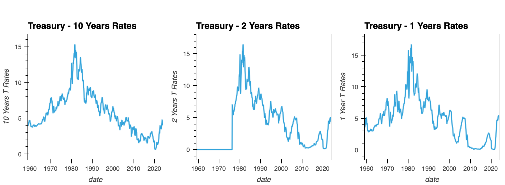

## Project Four

For Project 4, you will work with your group to solve, analyze, or visualize a problem using machine learning models (MLM) with the other technologies we’ve learned. Prepare a 15-minute data deep dive or infrastructure review that shows machine learning in the context of what we’ve already learned.

## Background

Team AEJJ is seeking to discover relationships between U.S. Gross Domestic Product (GDP) and overall economic health. Can machine learning predict a recession, with better than 75% accuracy, by analyzing historical GDP data?

## Setting up Agile Project

Assigned Agile workflow using github projects.  We set up the flow of Project Ideation, Project Poposal, Data Fetching, Data Analysis, Building the ML Model, Testing, Documenting and Presentation. These all include Roles, Communication, Collaboration, Milestones, and tracking when and where we are each day for the entire project to ensure that the project is completed.  Workflow can be found here:

https://github.com/users/ramkumarpj/projects/3

## Data Sourcing and Analysis

United States Department of Economics Government Site. Bureau of Economic Analysis (BEA).

National Income and Product Accounts Metadata CSV files download. We used the GDP as the main source as it has shown in the past that it has the strongest indicator.  We also included the Treasury GDP growth rate and Long-Term and short term interest rates.

The dataset contained 100 years worth of data.  We filtered the data to include the top 4 indicicators of a recession in the GDP. Some of the data was mising until 1959 so we started there.  Using an anaylsis of top indicators, we weighed 4 parts of the GDP makeup and analyized that.  

The more recent the data, the largest portions that makes up the total GDP, the higher the weight.

We looked at the quarterly data of the past 20 years to breakdown and filter the data using Python and creating easy to read visualizations.

We took the 10 year treasury interest rates minus the 2 year rate and the 10 year rate minus the 1 year.

The conclusion of this data showed the top 4 of the indicators is Personal consumption expenditures, Gross private domestic investment, Net exports of goods and services, Government consumption expenditures and gross investment.

To further breakdown the data collection, we show that the Personal Consumption Expenditures (PCE) includes Goods and Services. The GDP contains Gross Private Domestic Investments for Nonresidential and Residential. The Government consumption expenditures and gross investment includes net exports and net imports and the Defense and Nondefense.

## Data Model Implementation

The generally accepted definition of a recession in the U.S., according to Forbes, is when GDP shrinks in two consecutive quarters. A recession involves a significant decline in economic activity that is spread across the economy and lasts more than a few months. Comparing forecasts with their historical antecedents can produce a measure of the probability of a future recession. Taking into account these definitions, we needed to decide on what Machine Learning technology to use.  Machine Learning algorithms are often drawn from statistics, calculus, and linear algebra. 

Using Python, we started with Logistic Regression from Scikit-learn. The data we obtained was used to train the model, proccessed using standard scalar, to find the metrics and test we then used the mean squared error (MSE).  This allowed us to define the features to use for the prediction, define the target variable, create and fit the model, obtain the data and then test.

The next Machine Learning Model we used is Support Vector Machines (SVR) from Scikit-learn. This MLM finds the hyperplane that maximally separates the points of one class from those of the other class. It finds the hyperplane that has the largest margin between the points of the two classes. In Python, we inputed our previously filtered data for training and defined the target variable we wanted answered. We created the SVR pipeline in a scalar format. Afterwards we fit the model and then tested the model with an 0.85 accuracy.

We then tested Ensemble model learning. This technique combines several base machine learning models in order to produce one optimal predictive model. We imported the previous data and used Linear Regression,  XGBoost, and Random Forest. We split the data into training and training sets, defined and trained the models, and outputted the prediction. We then tested the prediction using MSE.  Afterwards we used GDP growth rate instead of overall GDP and tested using MSE.

## Data Model Optimization

As we analyzed the approach we took to find the best way to predict a recession, we found that using multiple ways to optimize the MLM was to try different approaches after discussing which model would work the best.  We created our code using Python and used multiple machine learning models to see the results. To test the accuracy of the model we used MSE.  Linear regression did give us a suitable result but we had to find different methods to train our model and show that it was working correctly in each dataframe.  SVR would give a similar result that was slightly more accurate according to our test. The team had to find ways work with the code to transform the data to be usable for a Time Series analysis. Using the data from our source, we obtained data points for each month and year. In each analysis, we created visualizations in order to create an easier understanding of our results.

After researching the Federal Reserve real time data and future predictions, we came to the conclusion that the Logistic Regression Model to be the most accurate way to determine an upcoming recession.  Our target variable is a future recession within 6-24 months.  The features we included are the difference between the long term and short term interest rate. The data used for this was the 10 year interest rate, and the 10-2 and 10-1 year interest rate.  The classification for the model is the GDP growth rate and seeing if we are positive or negative.

## Conclusion

The question we asked in this project was to find if we can use a machine learning model to predict a recession with better than 75% accuracy by analyzing historical GDP data. After using multiple models to test the accuracy of this prediction, we concluded that there is indeed a way to use MLM with a high accuracy to predict an future recession.  Our Python notebook labelled Logistic_Regression_Model shows our work in determining this.  The final conclusion we reached is that the logistic regression model for predicting an economic recession based on difference in the interest rates of long term and short term treasuries is able to achieve an accuracy score of 95.38%.

## Sources

U.S. Bureau of Economic Analysis, “Table 1. GDP and Personal Income,” apps.bea.gov/iTable/?ReqID=62&step=1#eyJhcHBpZCI6NjIsInN0ZXBzIjpbMSwyLDZdLCJkYXRhIjpbWyJQcm9kdWN0IiwiMSJdLFsiVGFibGVMaXN0IiwiMSJdXX0= (accessed April 9, 2024).

Federal Reserve Bank of St. Louis and US Office of Management and Budget, "Treasury Rates," https://fred.stlouisfed.org/docs/api/fred/ (accessed April 9, 2024).

Miller, David S. (2019). "Predicting Future Recessions," FEDS Notes. Washington: Board of Governors of the Federal Reserve System, May 6, 2019, https://doi.org/10.17016/2380-7172.2338.
